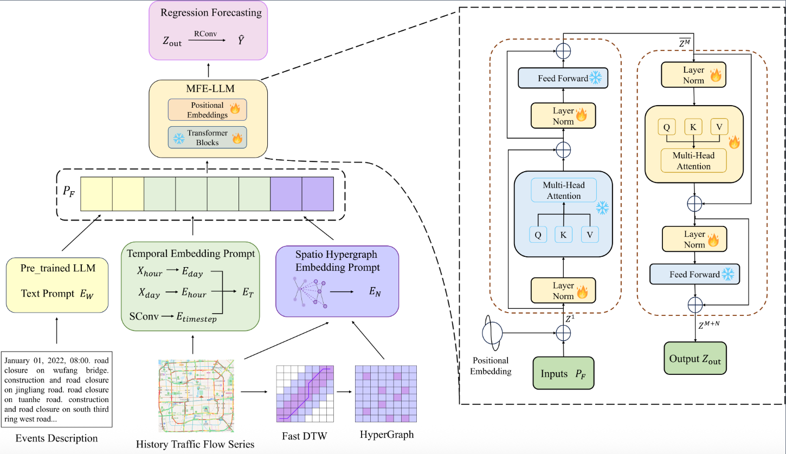

# TPGM_LLM

This repository contains the official code for our paper:  
**Emergency Events Traffic Flow Forecasting Using Text-Prompt-Guided Multimodal Large Language Models**  
*(Accepted by IEEE Transactions on Intelligent Transportation Systems, 2026)*


## 📖 Abstract
Emergency events like traffic accidents and natural disasters frequently cause severe disruptions to urban traffic patterns, posing challenges to conventional forecasting methods based on historical data. Recent progress has explored integrating auxiliary textual information from social media, news reports, and incident details to enhance forecasting models. However, these approaches often fail to effectively align semantic context from textual data with the spatio-temporal patterns in urban traffic flow. To bridge this disparity, we propose a novel framework called TPGM-LLM, which leverages text-prompt-guided multimodal large language models to dynamically assimilate real-time data, including incident reports, traffic sensors, and weather conditions. Specifically, the proposed framework integrates a pre-trained LLM-based text encoder to interpret descriptions of emergency events as semantic prompts. Furthermore, it incorporates a dynamic spatio-temporal hypergraph module that employs FastDTW to capture non-local dependencies among different road segments. Additionally, a multimodal feature extraction LLM is utilized to merge textual guidance with traffic dynamics in a hierarchical manner, enhancing the accuracy of long-term traffic forecasting. Experimental results on the Beijing Text-Traffic dataset (BjTT) demonstrate that the proposed model outperforms existing methods, highlighting its effectiveness in complex and dynamic traffic situations. 


## 🏗️ Framework

<p align="center">
  <a href="./frame.png">
    
  </a>
  <br>
  <em>Figure 1: Overall architecture of the proposed TPGM-LLM framework.</em>
</p>


## 🚀 Usage

### 1. Datasets

Download the dataset from [BjTT: A Large-scale Multimodal Dataset for Traffic Prediction](https://chyazhang.github.io/BjTT)  

### 2. Requirements
The required basic environment: Python 3.8 (Ubuntu 20.04) / CUDA 11.8

Install dependencies:

```bash
conda install python=3.8.19
conda env create -f requirements.yaml
conda init bash
exec bash
```
Activate the environment and install conflicting packages separately:
```bash
conda activate TPGM-LLM
pip install torch==2.4.1 torchvision==0.19.1
pip install pandas
pip install transformers
pip install --upgrade bottleneck
```
### 3. Preparation
Generate DTW hypergraph:
```bash
cd scripts/prepare_DTW
python data_init.py
python adj.py
```

### 4. Training
Train the model:
```bash
CUDA_VISIBLE_DEVICES=0
python train.py 2>&1 | tee output.log
```
output.log is the location to save the output logs.

### 5. Load model
Load the trained model using the path to the trained best_model.pth:

```bash
python load_model.py
```


## 🙏 Acknowledgments

This code is built upon [ST-LLM](https://github.com/ChenxiLiu-HNU/ST-LLM), We also thank the authors of BjTT for providing the valuable multimodal traffic dataset.

## 📝 Citation

If you find this work useful in your research, please consider citing our paper:
```
@article{lu2026emergency,
  title={Emergency Events Traffic Flow Forecasting Using Text-Prompt-Guided Multimodal Large Language Models},
  author={Lu, Yaxuan and Huo, Guangyu and Cui, Xiaohui and Wang, Boyue and Zhang, Yong and Cui, Zhiyong},
  journal={IEEE Transactions on Intelligent Transportation Systems},
  year={2026},
  publisher={IEEE}
}
```

## Contact Us

For questions or issues, please feel free to contact:
Yaxuan Lu – luyaxuan@bjfu.edu.cn

